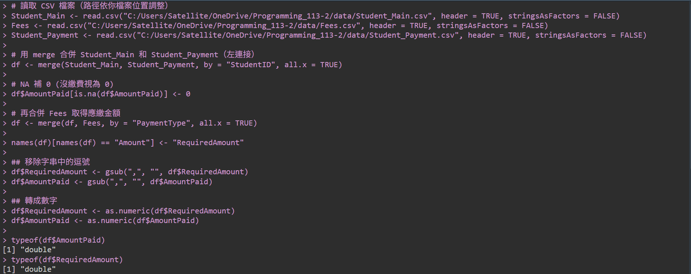

 
<div style="text-align: center; font-size: 25px;font-weight: bold;color: #000000;">
</br>
</br>
</br>
</br>
</br>
</br>
Programming Languages and Compilers
</br>
</br>
Programming Assignment #2
</br>
</br>
</br>
</br>

</div>
<div style="text-align: center; font-size: 18px;font-weight: 500;">
411135028 林奇安
<br>
411283051 陳沛慈
</div>

<div style="break-after: page; page-break-after: always;"></div>


## Problem description

#### Programming Exercise #1: 
Fact #1: Andy, Bob, Cecil, Dennis, Edward, Felix, Martin, Oscar, Quinn are male,and Gigi, Helen, Iris, Jane, Kate, Liz, Nancy, Pattie, Rebecca are female.
Fact #2: Bob and Helen are married, Dennis and Pattie are married, and Gigi and Martin are married.
Fact #3: Andy is Bob's parent, Bob is Cecil's parent, Cecil is Dennis' parent,Dennis is Edward's parent, Edward is Felix's parent, Gigi is Helen's parent, Helen is Iris' parent, Iris is Jane's parent, Jane is Kate's parent, Kate is Liz's parent,Martin is Nancy's parent, Nancy is Oscar's parent, Oscar is Pattie's parent, Pattie is Quinn's parent, and Quinn is Rebecca's parent.
Define the following relations in your program:
Relation #1: If X and Y are married, and X is Z's parent, then Y is also Z's parent.
Relation #2: If X is Y's parent, and X is Z's parent, then Y and Z are siblings.
Relation #3: If X and Y are siblings, X is male, and Y is male, then X and Y are brothers.
Relation #4: If X and Y are siblings, X is female, and Y is female, then X and Y are sisters.
Relation #5: If W and X are siblings, W is Y's parent, and X is Z's parent, then Y and Z are cousins.
Program Requirement: Your program needs to answer the relationship of any two persons correctly. For example: are Liz and Rebecca cousins?
A) Write a Java program for this exercise.
B) Write an ML program for this exercise.
C) Write a Prolog program for this exercise.
<br>

#### Programming Exercise #2: 
There are 3 tables for this exercise:
Table #1 Student-Main: the main table with Student ID, Name, and Payment Type.
Table #2 Fees: the Amount of fees required for each Payment Type.
Table #3 Student-Payment: the Amount paid by students before due.
Program Requirement: Your program needs to do the following computations correctly:
Computation #1: the total amount received from students before due.
Computation #2: list all the students that did not pay the required fees with the amount short.
A) Write a COBOL program to do the computations.
B) Write an R program to do the computations.

<div style="break-after: page; page-break-after: always;"></div>

## Program Design Highlights
#### #1(A) Java
1. **物件導向設計**：**`Person` 類別**
    * 姓名 (`name`) 與性別 (`gender`)
    * 配偶 (`spouse`)
    * 雙親 (`parent1`, `parent2`)
    * 子女清單 (`children`)

2. **關係建構與推理**：各種關係判斷方法（如 `isSiblingOf`, `isParentOf`, `isCousinOf` 等）
    * **兄弟姊妹（siblings）**：透過共同父母的子女集合判斷
    * **兄弟／姊妹（brother/sister）**：在是兄弟姊妹的前提下再確認性別
    * **堂表親（cousin）**：父母與對方父母是否為兄弟姊妹

3. **資料管理**
    * 使用 `HashMap<String, Person>` 儲存所有人物，確保每個姓名只對應一個人物物件。

    * **`getOrCreatePerson(name, gender)`**：若已存在該名人物則回傳，否則創建新的 `Person` 物件並存入 `people`。

    * **`setParentChild(parentName, childName)`**：設定父母與子女的關係；若父母已有配偶，也會一併為其配偶設為子女的父或母。

4. **家譜資料建立：`buildFamilyTree()`**
    * 創建對應 `Person` 物件並指定性別
    * 建立配偶關係與跨代的父母－子女關係，模擬多代的家族結構

5. **使用者互動介面**
    * **輸入操作：**
        * 使用者輸入兩個人物的姓名與一種關係類型
        * 輸出兩人是否存在該種關係的結果

    * **結束條件：** 輸入 `exit` 可隨時結束程式。


#### #1(B) ML

1. **資料建模**
    * **`genders`**：定義人物性別為 `Male` 或 `Female`
        - 以配對方式儲存每個人物的性別
    * **`marriages`**：以雙向配對形式記錄婚姻關係，`(Bob, Helen)` & `(Helen, Bob)` 都存在

    * **`parentChild`**：以 `(parent, child)` 配對方式記錄親屬關係

2. **邏輯推論設計**
    1. **查詢函數**
        * `genderOf`：查詢人物性別，傳回 `SOME Male/Female` 或 `NONE`。
        * `isMarried`：判斷兩人是否結婚。

    2. **親屬關係推論**
        * `parentsOf`：查找父母
            * 若父母已婚，則自動包含其配偶為父母

        * `siblings`
            * 根據共同父母推導兄弟姊妹名單
            * `List.filter`從兄弟姊妹名單中排除自己

        * `isSibling`, `isBrother`, `isSister`：
            * 判斷兩個人之間是否為手足、兄弟、姊妹

        * `cousins`, `isCousin`：推導堂表親
            * 從個人的父母找出他們的兄弟姊妹，再找出這些人的子女
            * `List.filter`：從 cousins 名單中排除掉自己 

    3. **關係查詢與輸出 `relationship`**：使用 `checkRelation` 函式對每筆測資進行輸出


#### #1(C) Prolog

1. **基本事實定義**
    * **性別：**：`male`/`female`
    * **婚姻關係**：`married` 
        - 定義為雙向事實：`married(bob, helen)` & `married(helen, bob)` 同時存在
    * **親子關係**：`parent_fact`

2. **關係推論規則設計**
    * **關係 #1：parent（父母關係）**
        * 若某人與另一人為配偶，且該配偶為某人的父母，則視為兩人共同為父母。
        * 直接繼承 `parent_fact/2` 資料，使用避免遞迴導致無限循環

    * **關係 #2：sibling（兄弟姊妹）**
        * 只要兩人有共同的父母且不是同一人，即可視為兄弟姊妹
        * `Y \= Z` 指出他們不是同一個人

    * **關係 #3：brother（兄弟）& #4：sister（姊妹）**

        * 在 sibling 關係基礎上，進一步檢查性別是否為男性或女性

    * **關係 #5：cousin（堂表親）**
        * 定義為兩人的父母互為兄弟姊妹，且兩人不是同一人
        * 運用前面定義的 sibling 規則，建立間接血緣關係的推論
        * `Y \= Z` 指出他們不是同一個人

3. **關係查詢與輸出**
    * **`relation/3`**：
        * 可輸出兩人之間的具體關係字串
        * 規則採用多層條件判斷，根據邏輯關係依序比對，優先回傳最明確的關係

    * **`check_relation/3`**
        * 輸入人名與關係，查詢是否為關係
        - 用 `format/3` 輸出


#### #2(A) COBOL
1. **資料結構設計**
   * `WORKING-STORAGE`：定義變數暫存處理過程中的資料，目前學生學號、姓名、應繳金額、已繳金額、差額...等
   * `STUDENT-TABLE`：儲存學生基本資料（學號、姓名、繳費類型）
   * `FEES-TABLE`：儲存每位學生實際繳交的費用資料
   * `PAYMENT-TYPE-TABLE`：定義各繳費類型（A/B/C）應繳金額

3. **主要處理邏輯與流程**
   * `INITIALIZE-DATA`：初始化學生資料、繳費資料及繳費類型金額表
   * 透過 `PERFORM` 迴圈逐一處理每位學生
     * `GET-PAYMENT-AMOUNT`：根據學生的繳費類型取得應繳金額
     * `GET-PAID-AMOUNT`：根據學生學號找出實際已繳金額
     * 比對應繳與實繳金額，若未繳完則顯示學號、姓名及短繳金額。
     * 同時累加所有學生的實際繳費金額。

4. **錯誤處理與特殊狀況**
   * 若學生未出現在 `FEES-TABLE` 中，則視為未繳費（已繳金額為 0）
   * 類型為 A 的學生設定為應繳金額 0，視為特殊類型
   * 實繳金額小於應繳金額，才會顯示差額
   
#### #2(B) R

1. **資料合併 `merge()`**：
    * 首先以 `StudentID` ，合併 Student_Main 和 Student_Payment
    * 接著以 `PaymentType` ，將合併結果與 `Fees` 資料再合併
2. **資料清理與格式轉換**
    * **處理缺漏值（NA）**：將 `AmountPaid` 欄位中的 `NA` 值轉為 `0`，代表尚未繳費。
    * **字串處理**：因為金額欄位可能含有逗號（如 "1,000"），透過 `gsub` 函數移除逗號，方便後續數值運算。
    * **資料型態轉換**：將 `AmountPaid` 和 `RequiredAmount` 欄位從字串轉為數值型態（numeric），以便進行加總與比較。

3. **計算與結果輸出**

    * **Computation #1：總繳費金額**
    利用 `sum()` 函數計算所有學生在繳費截止日前的總繳費金額，並以 `cat()` 輸出結果。

    * **Computation #2：未繳足名單與差額**
    找出繳費金額低於應繳金額的學生，計算其短缺金額（`AmountShort = RequiredAmount - AmountPaid`），並輸出包含以下資訊的表格：
        * 學號（StudentID）
        * 姓名（Name）
        * 繳費項目（PaymentType）
        * 已繳金額（AmountPaid）
        * 應繳金額（RequiredAmount）
        * 缺繳金額（AmountShort）

<div style="break-after: page; page-break-after: always;"></div>


## Program listing
#### #1(A) Java
```java
import java.util.*;

public class FamilyTreeInteractive {

    static class Person {
        String name;
        String gender;
        Person spouse;
        Person parent1, parent2;
        List<Person> children = new ArrayList<>();

        Person(String name, String gender) {
            this.name = name;
            this.gender = gender;
        }

        void addChild(Person child) {
            children.add(child);
            if (child.parent1 == null) {
                child.parent1 = this;
            } else if (child.parent2 == null && child.parent1 != this) {
                child.parent2 = this;
            }
        }

        void marry(Person partner) {
            this.spouse = partner;
            partner.spouse = this;
        }
        // 查詢父母與兄弟姊妹
        List<Person> getParents() {
            List<Person> parents = new ArrayList<>();
            if (parent1 != null) parents.add(parent1);
            if (parent2 != null) parents.add(parent2);
            return parents;
        }

        List<Person> getSiblings() {
            Set<Person> siblings = new HashSet<>();
            for (Person parent : getParents()) {
                siblings.addAll(parent.children);
            }
            siblings.remove(this);
            return new ArrayList<>(siblings);
        }

        // 判斷關係
        boolean isSiblingOf(Person other) {
            return this.getSiblings().contains(other);
        }

        boolean isBrotherOf(Person other) {
            return this.gender.equals("male") && isSiblingOf(other) && other.gender.equals("male");
        }

        boolean isSisterOf(Person other) {
            return this.gender.equals("female") && isSiblingOf(other) && other.gender.equals("female");
        }

        boolean isCousinOf(Person other) {
            for (Person p1 : this.getParents()) {
                for (Person p2 : other.getParents()) {
                    if (p1 != null && p2 != null && p1.isSiblingOf(p2)) {
                        return true;
                    }
                }
            }
            return false;
        }

        boolean isSpouseOf(Person other) {
            return this.spouse == other;
        }

        boolean isParentOf(Person child) {
            return this.children.contains(child);
        }

        boolean isChildOf(Person parent) {
            return parent.children.contains(this);
        }
    }

    // Map to store all people by name
    static Map<String, Person> people = new HashMap<>();

    // 取得或創建一個指定名字與性別的人
    public static Person getOrCreatePerson(String name, String gender) {
        return people.computeIfAbsent(name, n -> new Person(n, gender));
    }

    // 設定父母與子女之間的關係
    private static void setParentChild(String parentName, String childName) {
        Person parent = people.get(parentName);
        Person child = people.get(childName);
        parent.addChild(child);
        if (parent.spouse != null) {
            parent.spouse.addChild(child);
        }
    }

    // 建立整個家譜的資料
    public static void buildFamilyTree() {
        String[] males = {"Andy", "Bob", "Cecil", "Dennis", "Edward", "Felix", "Martin", "Oscar", "Quinn"};
        String[] females = {"Gigi", "Helen", "Iris", "Jane", "Kate", "Liz", "Nancy", "Pattie", "Rebecca"};

        // Create male persons
        for (String name : males) getOrCreatePerson(name, "male");
        // Create female persons
        for (String name : females) getOrCreatePerson(name, "female");

        // Set marriages
        getOrCreatePerson("Bob", "male").marry(getOrCreatePerson("Helen", "female"));
        getOrCreatePerson("Dennis", "male").marry(getOrCreatePerson("Pattie", "female"));
        getOrCreatePerson("Martin", "male").marry(getOrCreatePerson("Gigi", "female"));

        // Set parent-child relationships (tree structure)
        setParentChild("Andy", "Bob");
        setParentChild("Bob", "Cecil");
        setParentChild("Cecil", "Dennis");
        setParentChild("Dennis", "Edward");
        setParentChild("Edward", "Felix");

        setParentChild("Gigi", "Helen");
        setParentChild("Helen", "Iris");
        setParentChild("Iris", "Jane");
        setParentChild("Jane", "Kate");
        setParentChild("Kate", "Liz");

        setParentChild("Martin", "Nancy");
        setParentChild("Nancy", "Oscar");
        setParentChild("Oscar", "Pattie");
        setParentChild("Pattie", "Quinn");
        setParentChild("Quinn", "Rebecca");
    }

    public static void main(String[] args) {
        buildFamilyTree();
        Scanner scanner = new Scanner(System.in);
        System.out.println("Please enter two names and a relationship type.");
        System.out.println("Valid relationships: spouse, parent, child, sibling, brother, sister, cousin.");
        System.out.println("Type 'exit' to quit.");

        while (true) {
            System.out.print("Enter name1: ");
            String name1 = scanner.nextLine().trim();
            if (name1.equalsIgnoreCase("exit")) break;

            System.out.print("Enter name2: ");
            String name2 = scanner.nextLine().trim();
            if (name2.equalsIgnoreCase("exit")) break;

            System.out.print("Enter relationship type: ");
            String relationship = scanner.nextLine().trim().toLowerCase();
            if (relationship.equalsIgnoreCase("exit")) break;

            Person p1 = people.get(name1);
            Person p2 = people.get(name2);

            if (p1 == null || p2 == null) {
                System.out.println("One or both persons not found.\n");
                continue;
            }

            boolean result = false;
            switch (relationship) {
                case "spouse":
                    result = p1.isSpouseOf(p2);
                    break;
                case "parent":
                    result = p1.isParentOf(p2);
                    break;
                case "child":
                    result = p1.isChildOf(p2);
                    break;
                case "sibling":
                    result = p1.isSiblingOf(p2);
                    break;
                case "brother":
                    result = p1.isBrotherOf(p2);
                    break;
                case "sister":
                    result = p1.isSisterOf(p2);
                    break;
                case "cousin":
                    result = p1.isCousinOf(p2);
                    break;
                default:
                    System.out.println("Unknown relationship type. Please use: spouse, parent, child, sibling, brother, sister, cousin.\n");
                    continue;
            }

            if (result) {
                System.out.printf("%s and %s are %s.\n\n", name1, name2, relationship);
            } else {
                System.out.printf("%s and %s are not %s.\n\n", name1, name2, relationship);
            }
        }

        scanner.close();
    }
}
```
<div style="break-after: page; page-break-after: always;"></div>


#### #1(B) ML
```ML
datatype gender = Male | Female;

val genders = [
    ("Andy", Male), ("Bob", Male), ("Cecil", Male), ("Dennis", Male),
    ("Edward", Male), ("Felix", Male), ("Martin", Male), ("Oscar", Male),
    ("Quinn", Male), ("Gigi", Female), ("Helen", Female), ("Iris", Female),
    ("Jane", Female), ("Kate", Female), ("Liz", Female), ("Nancy", Female),
    ("Pattie", Female), ("Rebecca", Female)
];

val marriages = [
    ("Bob", "Helen"), ("Helen", "Bob"),
    ("Dennis", "Pattie"), ("Pattie", "Dennis"),
    ("Gigi", "Martin"), ("Martin", "Gigi")
];

val parentChild = [
    ("Andy", "Bob"), ("Bob", "Cecil"), ("Cecil", "Dennis"),
    ("Dennis", "Edward"), ("Edward", "Felix"),
    ("Gigi", "Helen"), ("Helen", "Iris"), ("Iris", "Jane"),
    ("Jane", "Kate"), ("Kate", "Liz"),
    ("Martin", "Nancy"), ("Nancy", "Oscar"), ("Oscar", "Pattie"),
    ("Pattie", "Quinn"), ("Quinn", "Rebecca")
];

fun genderOf name = 
    case List.find (fn (n, _) => n = name) genders of
        SOME (_, g) => SOME g
      | NONE => NONE;

fun isMarried (x, y) = List.exists (fn (a, b) => a = x andalso b = y) marriages;

fun parentsOf child =
    let
        val directParents = List.filter (fn (p, c) => c = child) parentChild
        fun addSpouse (p, _) = 
            case List.find (fn (a, b) => a = p) marriages of
                SOME (_, spouse) => [p, spouse]
              | NONE => [p]
    in
        List.concat (List.map addSpouse directParents)
    end;

fun siblings name =
    let
        val ps = parentsOf name
        val sibs = List.concat (List.map (fn p => List.map #2 (List.filter (fn (par, _) => par = p) parentChild)) ps)
    in
        List.filter (fn n => n <> name) sibs
    end;

fun isSibling (x, y) = List.exists (fn sib => sib = y) (siblings x);

fun isBrother (x, y) =
    isSibling(x, y) andalso genderOf x = SOME Male andalso genderOf y = SOME Male;

fun isSister (x, y) =
    isSibling(x, y) andalso genderOf x = SOME Female andalso genderOf y = SOME Female;

fun cousins x =
    let
        val ps = parentsOf x
        val auntsUncles = List.concat (List.map siblings ps)
        val cousinsList = List.concat (List.map (fn p => List.map #2 (List.filter (fn (par, _) => par = p) parentChild)) auntsUncles)
    in
        List.filter (fn n => n <> x) cousinsList
    end;

fun isCousin (x, y) = List.exists (fn c => c = y) (cousins x);

(* check *)
fun checkRelation (x, y, relation) =
    case relation of
        "sibling" => if isSibling(x, y) then "Yes, they are siblings\n" else "No, they are not siblings\n"
      | "brother" => if isBrother(x, y) then "Yes, they are brothers\n" else "No, they are not brothers\n"
      | "sister" => if isSister(x, y) then "Yes, they are sisters\n" else "No, they are not sisters\n"
      | "cousin" => if isCousin(x, y) then "Yes, they are cousins\n" else "No, they are not cousins\n"
      | "parent" => if List.exists (fn p => p = x) (parentsOf y) then "Yes, " ^ x ^ " is a parent of " ^ y ^ "\n" else "No, " ^ x ^ " is not a parent of " ^ y ^ "\n"
      | "child" => if List.exists (fn p => p = y) (parentsOf x) then "Yes, " ^ x ^ " is a child of " ^ y ^ "\n" else "No, " ^ x ^ " is not a child of " ^ y ^ "\n"
      | "married" => if isMarried(x, y) then "Yes, " ^ x ^ " and " ^ y ^ " are married\n" else "No, " ^ x ^ " and " ^ y ^ " are not married\n"
      | _ => "Unknown relationship type: " ^ relation ^ "\n";

(* 測資 *)
val testCases = [
    ("Bob", "Helen", "married"),
    ("Cecil", "Dennis", "sibling"),
    ("Liz", "Rebecca", "sister"),
    ("Edward", "Quinn", "parent"),
    ("Felix", "Iris", "cousin"),
    ("Andy", "Bob", "parent"),
    ("Gigi", "Martin", "married"),
    ("Helen", "Gigi", "sibling"),
    ("Bob", "Andy", "child")
];

val _ = List.app (fn (a,b,rel) => print (checkRelation(a,b,rel))) testCases;

```
<div style="break-after: page; page-break-after: always;"></div>

#### #1(C) Prolog
```Prolog
% 性別
male(andy). male(bob). male(cecil). male(dennis). male(edward). male(felix).
male(martin). male(oscar). male(quinn).
female(gigi). female(helen). female(iris). female(jane).
female(kate). female(liz). female(nancy). female(pattie). female(rebecca).

% 婚姻
married(bob, helen). married(helen, bob).
married(dennis, pattie). married(pattie, dennis).
married(gigi, martin). married(martin, gigi).

% 父母事實
parent_fact(andy, bob).
parent_fact(bob, cecil).
parent_fact(cecil, dennis).
parent_fact(dennis, edward).
parent_fact(edward, felix).

parent_fact(gigi, helen).
parent_fact(helen, iris).
parent_fact(iris, jane).
parent_fact(jane, kate).
parent_fact(kate, liz).

parent_fact(martin, nancy).
parent_fact(nancy, oscar).
parent_fact(oscar, pattie).
parent_fact(pattie, quinn).
parent_fact(quinn, rebecca).

% Relation #1: 父母關係推論
parent(X, Y) :- parent_fact(X, Y).
parent(Y, Z) :- married(X, Y), parent_fact(X, Z).

% Relation #2: 兄弟姊妹
sibling(Y, Z) :- parent(X, Y), parent(X, Z), Y \= Z.

% Relation #3: 兄弟
brother(X, Y) :- sibling(X, Y), male(X), male(Y).

% Relation #4: 姊妹
sister(X, Y) :- sibling(X, Y), female(X), female(Y).

% Relation #5: 表親
cousin(Y, Z) :-
    parent(W, Y),
    parent(X, Z),
    sibling(W, X),
    Y \= Z.

% 關係判定
relation(brother, X, Y) :- brother(X, Y).
relation(sister, X, Y) :- sister(X, Y).
relation(sibling, X, Y) :- sibling(X, Y).
relation(cousin, X, Y) :- cousin(X, Y).
relation(parent, X, Y) :- parent(X, Y).
relation(child, X, Y) :- parent(Y, X).
relation(married, X, Y) :- married(X, Y).

% check 是否為該關係
check_relation(X, Y, Relation) :-
    relation(Relation, X, Y),
    format("Yes, ~w and ~w are ~w.~n", [X, Y, Relation]).

check_relation(X, Y, Relation) :-
    \+ relation(Relation, X, Y),
    format("No, ~w and ~w are not ~w.~n", [X, Y, Relation]).

main :-
    check_relation(bob, helen, married),
    check_relation(andy, bob, parent),
    check_relation(bob, andy, child),
    check_relation(cecil, dennis, brother),
    check_relation(iris, jane, sister),
    check_relation(liz, rebecca, cousin),
    check_relation(pattie, quinn, parent),
    check_relation(martin, iris, cousin),
    check_relation(gigi, liz, parent),
    halt.

:- main.

```
<div style="break-after: page; page-break-after: always;"></div>

#### #2(A) COBOL
```cobol
       IDENTIFICATION DIVISION.
       PROGRAM-ID. STUDENT-FEE-CHECK.

       DATA DIVISION.
       WORKING-STORAGE SECTION.
       01  WS-STUDENT-ID         PIC 9(9).
       01  WS-STUDENT-NAME       PIC X(10).
       01  WS-PAYMENT-TYPE       PIC X.
       01  WS-FEE                PIC 9(5) VALUE 0.
       01  WS-PAID-AMOUNT        PIC 9(5) VALUE 0.
       01  WS-REQUIRED-AMOUNT    PIC 9(5) VALUE 0.
       01  WS-SHORT-AMOUNT       PIC 9(5) VALUE 0.
       01  WS-TOTAL-RECEIVED     PIC 9(9) VALUE 0.
       01  WS-I                  PIC 99 VALUE 1.
       01  WS-J                  PIC 99 VALUE 1.
       01  MAX-STUDENTS          PIC 99 VALUE 18.
       01  MAX-FEES              PIC 99 VALUE 12.

       01  STUDENT-TABLE.
           05 STUDENT-ENTRY OCCURS 18 TIMES.
              10 STUDENT-ID        PIC 9(9).
              10 STUDENT-NAME      PIC X(10).
              10 STUDENT-TYPE      PIC X.

       01  FEES-TABLE.
           05 FEES-ENTRY OCCURS 12 TIMES.
              10 FEE-STUDENT-ID    PIC 9(9).
              10 FEE-AMOUNT        PIC 9(5).

       01  PAYMENT-TYPE-TABLE.
           05 PAYMENT-ENTRY OCCURS 3 TIMES.
              10 PAYMENT-TYPE-CODE  PIC X.
              10 PAYMENT-AMOUNT     PIC 9(5).

       PROCEDURE DIVISION.
       MAIN-PROGRAM.

           DISPLAY "=== STUDENT PAYMENT SUMMARY ===".

           PERFORM INITIALIZE-DATA.

           PERFORM VARYING WS-I FROM 1 BY 1 UNTIL WS-I > MAX-STUDENTS
               MOVE STUDENT-ID(WS-I)    TO WS-STUDENT-ID
               MOVE STUDENT-NAME(WS-I)  TO WS-STUDENT-NAME
               MOVE STUDENT-TYPE(WS-I)  TO WS-PAYMENT-TYPE

               PERFORM GET-PAYMENT-AMOUNT
               PERFORM GET-PAID-AMOUNT

               ADD WS-PAID-AMOUNT TO WS-TOTAL-RECEIVED

               IF WS-PAID-AMOUNT < WS-REQUIRED-AMOUNT THEN
                   COMPUTE WS-SHORT-AMOUNT = WS-REQUIRED-AMOUNT
                       - WS-PAID-AMOUNT
                   DISPLAY WS-STUDENT-ID " " WS-STUDENT-NAME
                           " : " WS-SHORT-AMOUNT
           END-IF

           END-PERFORM
           
           DISPLAY "TOTAL: "
                   WS-TOTAL-RECEIVED

           STOP RUN.

       INITIALIZE-DATA.
           MOVE 920121001 TO STUDENT-ID(1)
           MOVE "Andy     " TO STUDENT-NAME(1)
           MOVE "A" TO STUDENT-TYPE(1)

           MOVE 920121002 TO STUDENT-ID(2)
           MOVE "Bob      " TO STUDENT-NAME(2)
           MOVE "B" TO STUDENT-TYPE(2)

           MOVE 920121003 TO STUDENT-ID(3)
           MOVE "Cecil    " TO STUDENT-NAME(3)
           MOVE "C" TO STUDENT-TYPE(3)

           MOVE 920121004 TO STUDENT-ID(4)
           MOVE "Dennis   " TO STUDENT-NAME(4)
           MOVE "A" TO STUDENT-TYPE(4)

           MOVE 920121005 TO STUDENT-ID(5)
           MOVE "Edward   " TO STUDENT-NAME(5)
           MOVE "B" TO STUDENT-TYPE(5)

           MOVE 920121006 TO STUDENT-ID(6)
           MOVE "Felix    " TO STUDENT-NAME(6)
           MOVE "C" TO STUDENT-TYPE(6)

           MOVE 920121007 TO STUDENT-ID(7)
           MOVE "Gigi     " TO STUDENT-NAME(7)
           MOVE "B" TO STUDENT-TYPE(7)

           MOVE 920121008 TO STUDENT-ID(8)
           MOVE "Helen    " TO STUDENT-NAME(8)
           MOVE "B" TO STUDENT-TYPE(8)

           MOVE 920121009 TO STUDENT-ID(9)
           MOVE "Iris     " TO STUDENT-NAME(9)
           MOVE "B" TO STUDENT-TYPE(9)

           MOVE 920121010 TO STUDENT-ID(10)
           MOVE "Jane     " TO STUDENT-NAME(10)
           MOVE "A" TO STUDENT-TYPE(10)

           MOVE 920121011 TO STUDENT-ID(11)
           MOVE "Kate     " TO STUDENT-NAME(11)
           MOVE "B" TO STUDENT-TYPE(11)

           MOVE 920121012 TO STUDENT-ID(12)
           MOVE "Liz      " TO STUDENT-NAME(12)
           MOVE "C" TO STUDENT-TYPE(12)

           MOVE 920121013 TO STUDENT-ID(13)
           MOVE "Martin   " TO STUDENT-NAME(13)
           MOVE "A" TO STUDENT-TYPE(13)

           MOVE 920121014 TO STUDENT-ID(14)
           MOVE "Nancy    " TO STUDENT-NAME(14)
           MOVE "B" TO STUDENT-TYPE(14)

           MOVE 920121015 TO STUDENT-ID(15)
           MOVE "Oscar    " TO STUDENT-NAME(15)
           MOVE "C" TO STUDENT-TYPE(15)

           MOVE 920121016 TO STUDENT-ID(16)
           MOVE "Pattie   " TO STUDENT-NAME(16)
           MOVE "B" TO STUDENT-TYPE(16)

           MOVE 920121017 TO STUDENT-ID(17)
           MOVE "Quinn    " TO STUDENT-NAME(17)
           MOVE "B" TO STUDENT-TYPE(17)

           MOVE 920121018 TO STUDENT-ID(18)
           MOVE "Rebecca  " TO STUDENT-NAME(18)
           MOVE "B" TO STUDENT-TYPE(18)

           MOVE 920121005 TO FEE-STUDENT-ID(1)
           MOVE 21345 TO FEE-AMOUNT(1)

           MOVE 920121009 TO FEE-STUDENT-ID(2)
           MOVE 21345 TO FEE-AMOUNT(2)

           MOVE 920121003 TO FEE-STUDENT-ID(3)
           MOVE 42690 TO FEE-AMOUNT(3)

           MOVE 920121017 TO FEE-STUDENT-ID(4)
           MOVE 21345 TO FEE-AMOUNT(4)

           MOVE 920121012 TO FEE-STUDENT-ID(5)
           MOVE 21345 TO FEE-AMOUNT(5)

           MOVE 920121002 TO FEE-STUDENT-ID(6)
           MOVE 21345 TO FEE-AMOUNT(6)

           MOVE 920121014 TO FEE-STUDENT-ID(7)
           MOVE 15000 TO FEE-AMOUNT(7)

           MOVE 920121018 TO FEE-STUDENT-ID(8)
           MOVE 21345 TO FEE-AMOUNT(8)

           MOVE 920121011 TO FEE-STUDENT-ID(9)
           MOVE 20000 TO FEE-AMOUNT(9)

           MOVE 920121006 TO FEE-STUDENT-ID(10)
           MOVE 42690 TO FEE-AMOUNT(10)

           MOVE 920121015 TO FEE-STUDENT-ID(11)
           MOVE 21345 TO FEE-AMOUNT(11)

           MOVE 920121008 TO FEE-STUDENT-ID(12)
           MOVE 10000 TO FEE-AMOUNT(12)

           MOVE "A" TO PAYMENT-TYPE-CODE(1)
           MOVE 00000 TO PAYMENT-AMOUNT(1)

           MOVE "B" TO PAYMENT-TYPE-CODE(2)
           MOVE 21345 TO PAYMENT-AMOUNT(2)

           MOVE "C" TO PAYMENT-TYPE-CODE(3)
           MOVE 42690 TO PAYMENT-AMOUNT(3).

       GET-PAYMENT-AMOUNT.
           PERFORM VARYING WS-J FROM 1 BY 1 UNTIL WS-J > 3
               IF PAYMENT-TYPE-CODE(WS-J) = WS-PAYMENT-TYPE THEN
                   MOVE PAYMENT-AMOUNT(WS-J) TO WS-REQUIRED-AMOUNT
               END-IF
           END-PERFORM.

       GET-PAID-AMOUNT.
           MOVE 0 TO WS-PAID-AMOUNT
           PERFORM VARYING WS-J FROM 1 BY 1 UNTIL WS-J > MAX-FEES
               IF FEE-STUDENT-ID(WS-J) = WS-STUDENT-ID THEN
                   MOVE FEE-AMOUNT(WS-J) TO WS-PAID-AMOUNT
               END-IF
           END-PERFORM.

```

<div style="break-after: page; page-break-after: always;"></div>

#### #2(B) R
```R

# 讀取 CSV 檔案（路徑依你檔案位置調整）
Student_Main <- read.csv("C:/Users/Satellite/OneDrive/Programming_113-2/data/Student_Main.csv", header = TRUE, stringsAsFactors = FALSE)
Fees <- read.csv("C:/Users/Satellite/OneDrive/Programming_113-2/data/Fees.csv", header = TRUE, stringsAsFactors = FALSE)
Student_Payment <- read.csv("C:/Users/Satellite/OneDrive/Programming_113-2/data/Student_Payment.csv", header = TRUE, stringsAsFactors = FALSE)

# 用 merge 合併 Student_Main 和 Student_Payment（左連接）
df <- merge(Student_Main, Student_Payment, by = "StudentID", all.x = TRUE)

# NA 補 0 (沒繳費視為 0)
df$AmountPaid[is.na(df$AmountPaid)] <- 0

# 再合併 Fees 取得應繳金額
df <- merge(df, Fees, by = "PaymentType", all.x = TRUE)

names(df)[names(df) == "Amount"] <- "RequiredAmount"

## 移除字串中的逗號
df$RequiredAmount <- gsub(",", "", df$RequiredAmount)
df$AmountPaid <- gsub(",", "", df$AmountPaid)

## 轉成數字
df$RequiredAmount <- as.numeric(df$RequiredAmount)
df$AmountPaid <- as.numeric(df$AmountPaid)

typeof(df$AmountPaid)
typeof(df$RequiredAmount)

# 計算 #1：繳費截止日前已繳總金額
total_received <- sum(df$AmountPaid, na.rm = TRUE)
cat("Computation #1: Total amount received before due =", total_received, "\n")

# 計算 #2：未繳足應繳費用者與差額
df_unpaid <- df[df$AmountPaid < df$RequiredAmount, ]
df_unpaid$AmountShort <- df_unpaid$RequiredAmount - df_unpaid$AmountPaid

# 列出結果
cat("Computation #2: Students who did not pay the required fees and amount short:\n")
print(df_unpaid[, c("StudentID", "Name", "PaymentType", "AmountPaid", "RequiredAmount", "AmountShort")])
```

<div style="break-after: page; page-break-after: always;"></div>


## Result
#### #1(A) Java
<p align="left">
  
</p>

#### #1(B) ML
<p align="left">
  
</p>

#### #1(C) Prolog
<p align="left">
  
</p>


#### #2(A) COBOL
<p align="left">
  
</p>

#### #2(B) R
<p align="left">
  
  
</p>

<div style="break-after: page; page-break-after: always;"></div>

## Discussion
#### **Programming Exercise #1**
- **Java** 採用物件導向設計，透過 `Person` 類別封裝姓名、性別、配偶及子女資訊，強調資料結構與關係管理，適合大型系統，但需注意雙向關係的一致性。
- **ML** 則利用函數式與代數資料型態，以串列與遞迴函式處理關係，程式碼簡潔易懂，但需額外維護資料對稱性。
- **Prolog** 作為邏輯程式語言，透過事實與規則描述關係，擅長邏輯推理與自動搜尋，語意直觀且易擴充，然而控制流程非命令式，除錯較為複雜。
- 三種語言各具特色，Java 注重狀態與封裝，ML 提供函數式抽象，Prolog 則強調邏輯關係推理。

#### **Programming Exercise #2**
- **COBOL** 程式以其傳統的結構化程序設計，使用多維陣列保存學生資料、繳費紀錄及繳費類型，此設計反映了 COBOL 在商業資料處理上的穩定性與嚴謹性，但語法較為冗長，且資料初始化多手動設定，對動態資料支援較弱。

- **R** 利用 data frame 與強大的資料操作函式，讀取 CSV 檔案，R 的程式碼簡潔且易於維護，適合資料分析與報表產出，但在處理大量交易資料或複雜商業邏輯時，效率與結構化能力不及 COBOL。

- COBOL 強調嚴謹的數據結構與流程控制，適合企業系統的批次處理，R 較為靈活且有高效的資料分析能力，適合即時分析與視覺化呈現。

