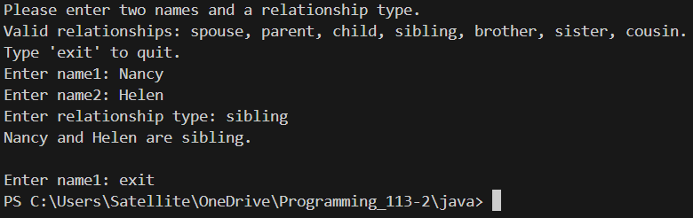
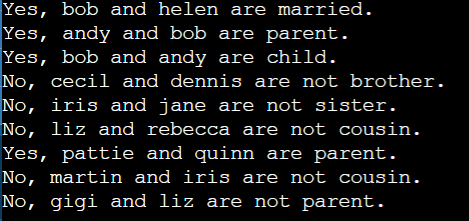
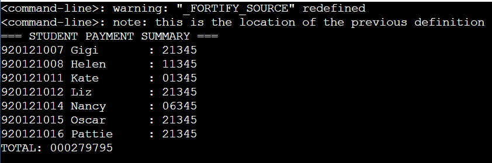
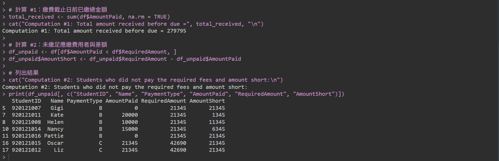
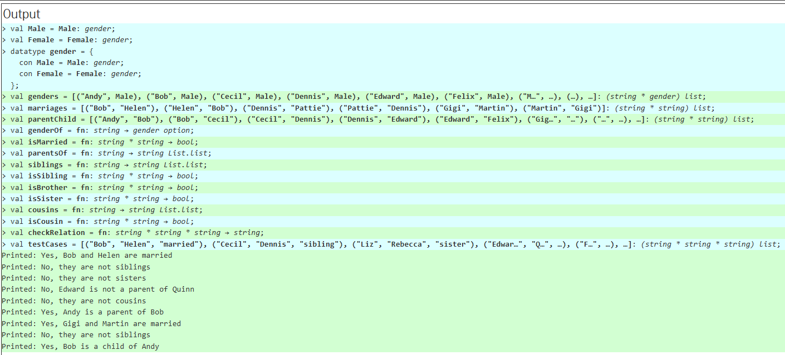

 
<div style="text-align: center; font-size: 25px;font-weight: bold;color: #000000;">
</br>
</br>
</br>
</br>
</br>
</br>
Programming Languages and Compilers
</br>
</br>
Programming Assignment #1
</br>
</br>
</br>
</br>

</div>
<div style="text-align: center; font-size: 18px;font-weight: 500;">
411135028 林奇安
<br>
411283051 陳沛慈
</div>

<div style="break-after: page; page-break-after: always;"></div>


## Problem description

#### Programming Exercise #1: 
Fact #1: Andy, Bob, Cecil, Dennis, Edward, Felix, Martin, Oscar, Quinn are male,and Gigi, Helen, Iris, Jane, Kate, Liz, Nancy, Pattie, Rebecca are female.
Fact #2: Bob and Helen are married, Dennis and Pattie are married, and Gigi and Martin are married.
Fact #3: Andy is Bob's parent, Bob is Cecil's parent, Cecil is Dennis' parent,Dennis is Edward's parent, Edward is Felix's parent, Gigi is Helen's parent, Helen is Iris' parent, Iris is Jane's parent, Jane is Kate's parent, Kate is Liz's parent,Martin is Nancy's parent, Nancy is Oscar's parent, Oscar is Pattie's parent, Pattie is Quinn's parent, and Quinn is Rebecca's parent.
Define the following relations in your program:
Relation #1: If X and Y are married, and X is Z's parent, then Y is also Z's parent.
Relation #2: If X is Y's parent, and X is Z's parent, then Y and Z are siblings.
Relation #3: If X and Y are siblings, X is male, and Y is male, then X and Y are brothers.
Relation #4: If X and Y are siblings, X is female, and Y is female, then X and Y are sisters.
Relation #5: If W and X are siblings, W is Y's parent, and X is Z's parent, then Y and Z are cousins.
Program Requirement: Your program needs to answer the relationship of any two persons correctly. For example: are Liz and Rebecca cousins?
A) Write a Java program for this exercise.
B) Write an ML program for this exercise.
C) Write a Prolog program for this exercise.
<br>

#### Programming Exercise #2: 
There are 3 tables for this exercise:
Table #1 Student-Main: the main table with Student ID, Name, and Payment Type.
Table #2 Fees: the Amount of fees required for each Payment Type.
Table #3 Student-Payment: the Amount paid by students before due.
Program Requirement: Your program needs to do the following computations correctly:
Computation #1: the total amount received from students before due.
Computation #2: list all the students that did not pay the required fees with the amount short.
A) Write a COBOL program to do the computations.
B) Write an R program to do the computations.

<div style="break-after: page; page-break-after: always;"></div>

## Program Design Highlights
#### #1(A) Java
1. **物件導向設計（Object-Oriented Design）**
    *  `Person` 代表一個人，封裝個人資料與家庭關係（如：父母、子女、配偶）。
    * 每個人擁有自己的方法來查詢家庭關係，如 `isSiblingOf`、`isParentOf` 等，實踐「資料與行為封裝」的原則。

2. **關係建構與推理（Family Relationship Modeling）**

    * 利用 `parent1` 和 `parent2` 屬性建立雙親結構，支援血緣與婚姻關係。
    * 透過 `addChild` 方法建立雙向的親子關係（父母知道孩子，孩子知道父母）。
    * 實作了常見的家庭關係辨識方法，包括：
        * `isSpouseOf`
        * `isParentOf` / `isChildOf`
        * `isSiblingOf`, `isBrotherOf`, `isSisterOf`
        * `isCousinOf`（表親判斷）

3. **靜態資料建立與模擬（Family Tree Construction）**
    * 使用 `buildFamilyTree` 方法預先定義一組家庭資料，模擬多代家譜結構。
    * 每個人透過 `getOrCreatePerson` 以名字與性別建立或取得唯一實例，避免重複。

4. **互動式查詢（Interactive Console Interface）**
    * 在 `main` 函數中，使用 `Scanner` 提供命令列互動，讓使用者輸入兩個人名進行關係查詢。
    * 提供清楚的提示訊息與結束條件（輸入 `exit` 離開）。

5. **資料結構應用**
    * 使用 `HashMap<String, Person>` 儲存所有人物資料，以名字作為鍵，便於快速查找。
    * 利用 `List` 和 `Set` 管理多個子女與兄弟姊妹，確保不重複又可排序輸出。

#### #1(B) ML

1. **資料建模（Data Modeling）**
    * **`genders`**：定義人物性別為 `Male` 或 `Female`
        - 以配對方式儲存每個人物的性別
    * **`marriages`**：以雙向配對形式記錄婚姻關係，`(Bob, Helen)` & `(Helen, Bob)` 都存在

    * **`parentChild`**：以 `(parent, child)` 配對方式記錄親屬關係

2. **邏輯推論設計（Logical Inference）**
    1. **查詢函數**
        * `genderOf`：查詢人物性別，傳回 `SOME Male/Female` 或 `NONE`。
        * `isMarried`：判斷兩人是否結婚。

    2. **親屬關係推論**
        * `parentsOf`：查找父母
            * 若父母已婚，則自動包含其配偶為父母

        * `siblings`
            * 根據共同父母推導兄弟姊妹名單
            * `List.filter`從兄弟姊妹名單中排除自己

        * `isSibling`, `isBrother`, `isSister`：
            * 判斷兩個人之間是否為手足、兄弟、姊妹

        * `cousins`, `isCousin`：推導堂表親
            * 從個人的父母找出他們的兄弟姊妹，再找出這些人的子女
            * `List.filter`：從 cousins 名單中排除掉自己 

    3. **關係查詢與輸出 `relationship`**：接收兩人名稱後，依據優先順序依次判斷以下關係，使用 `print` 輸出結果：
        - 兄弟／姊妹／兄妹
        - 堂表親
        - 父母子女
        - 婚姻關係
        - 無直接關係（Fallback）'

#### #1(C) Prolog

1. **基本事實定義**
    * **性別：**：`male`/`female`
    * **婚姻關係**：`married` 
        - 定義為雙向事實：`married(bob, helen)` & `married(helen, bob)` 同時存在
    * **親子關係**：`parent_fact`

2. **關係推論規則（Rules）設計**
    * **關係 #1：parent（父母關係）**
        * 若某人與另一人為配偶，且該配偶為某人的父母，則視為兩人共同為父母。
        * 直接繼承 `parent_fact/2` 資料，使用避免遞迴導致無限循環

    * **關係 #2：sibling（兄弟姊妹）**
        * 只要兩人有共同的父母且不是同一人，即可視為兄弟姊妹
        * `Y \= Z` 指出他們不是同一個人

    * **關係 #3：brother（兄弟）& #4：sister（姊妹）**

        * 在 sibling 關係基礎上，進一步檢查性別是否為男性或女性

    * **關係 #5：cousin（堂表親）**
        * 定義為兩人的父母互為兄弟姊妹，且兩人不是同一人
        * 運用前面定義的 sibling 規則，建立間接血緣關係的推論
        * `Y \= Z` 指出他們不是同一個人

3. **關係查詢與輸出**
    * **`relation/3`**：
        * 可輸出兩人之間的具體關係字串
        * 規則採用多層條件判斷，根據邏輯關係依序比對，優先回傳最明確的關係。

    * **`check_relation/2`**
        * 將特定人名帶入 `check_relation/2` 中查詢其關係
        - 用 `format/3` 輸出


#### #2(A) COBOL
1. **資料結構設計**
   * `WORKING-STORAGE`：定義變數暫存處理過程中的資料，目前學生學號、姓名、應繳金額、已繳金額、差額...等
   * `STUDENT-TABLE`：儲存學生基本資料（學號、姓名、繳費類型）
   * `FEES-TABLE`：儲存每位學生實際繳交的費用資料
   * `PAYMENT-TYPE-TABLE`：定義各繳費類型（A/B/C）應繳金額

3. **主要處理邏輯與流程**
   * `INITIALIZE-DATA`：初始化學生資料、繳費資料及繳費類型金額表
   * 透過 `PERFORM` 迴圈逐一處理每位學生
     * `GET-PAYMENT-AMOUNT`：根據學生的繳費類型取得應繳金額
     * `GET-PAID-AMOUNT`：根據學生學號找出實際已繳金額
     * 比對應繳與實繳金額，若未繳完則顯示學號、姓名及短繳金額。
     * 同時累加所有學生的實際繳費金額。

4. **錯誤處理與特殊狀況**
   * 若學生未出現在 `FEES-TABLE` 中，則視為未繳費（已繳金額為 0）
   * 類型為 A 的學生設定為應繳金額 0，視為特殊類型
   * 實繳金額小於應繳金額，才會顯示差額
   
#### #2(B) R

1. **資料合併 `merge()`**：
    * 首先以 `StudentID` ，合併 Student_Main 和 Student_Payment
    * 接著以 `PaymentType` ，將合併結果與 `Fees` 資料再合併
2. **資料清理與格式轉換**
    * **處理缺漏值（NA）**：將 `AmountPaid` 欄位中的 `NA` 值轉為 `0`，代表尚未繳費。
    * **字串處理**：因為金額欄位可能含有逗號（如 "1,000"），透過 `gsub` 函數移除逗號，方便後續數值運算。
    * **資料型態轉換**：將 `AmountPaid` 和 `RequiredAmount` 欄位從字串轉為數值型態（numeric），以便進行加總與比較。

3. **計算與結果輸出**

    * **Computation #1：總繳費金額**
    利用 `sum()` 函數計算所有學生在繳費截止日前的總繳費金額，並以 `cat()` 輸出結果。

    * **Computation #2：未繳足名單與差額**
    找出繳費金額低於應繳金額的學生，計算其短缺金額（`AmountShort = RequiredAmount - AmountPaid`），並輸出包含以下資訊的表格：
        * 學號（StudentID）
        * 姓名（Name）
        * 繳費項目（PaymentType）
        * 已繳金額（AmountPaid）
        * 應繳金額（RequiredAmount）
        * 缺繳金額（AmountShort）

## Program listing
#### #1(A) Java
```java

```
#### #1(B) ML
```ML

```
#### #1(C) Prolog
```Prolog

```
#### #2(A) COBOL
```cobol

```
#### #2(B) R
```R

# 讀取 CSV 檔案（路徑依你檔案位置調整）
Student_Main <- read.csv("C:/Users/Satellite/OneDrive/Programming_113-2/data/Student_Main.csv", header = TRUE, stringsAsFactors = FALSE)
Fees <- read.csv("C:/Users/Satellite/OneDrive/Programming_113-2/data/Fees.csv", header = TRUE, stringsAsFactors = FALSE)
Student_Payment <- read.csv("C:/Users/Satellite/OneDrive/Programming_113-2/data/Student_Payment.csv", header = TRUE, stringsAsFactors = FALSE)

# 用 merge 合併 Student_Main 和 Fees（左連接）
df <- merge(Student_Main, Student_Payment, by = "StudentID", all.x = TRUE)

# NA 補 0 (沒繳費視為 0)
df$AmountPaid[is.na(df$AmountPaid)] <- 0

# 再合併 Student_Payment 取得應繳金額
df <- merge(df, Fees, by = "PaymentType", all.x = TRUE)

# 重命名方便理解
names(df)[names(df) == "Amount"] <- "RequiredAmount"

df$RequiredAmount <- gsub(",", "", df$RequiredAmount)
df$AmountPaid <- gsub(",", "", df$AmountPaid)
df$RequiredAmount <- as.numeric(df$RequiredAmount)
df$AmountPaid <- as.numeric(df$AmountPaid)

typeof(df$AmountPaid)
typeof(df$RequiredAmount)

# 計算 #1：繳費截止日前已繳總金額
total_received <- sum(df$AmountPaid, na.rm = TRUE)
cat("Computation #1: Total amount received before due =", total_received, "\n")

# 計算 #2：未繳足應繳費用者與差額
df_unpaid <- df[df$AmountPaid < df$RequiredAmount, ]
df_unpaid$AmountShort <- df_unpaid$RequiredAmount - df_unpaid$AmountPaid

# 列出結果
cat("Computation #2: Students who did not pay the required fees and amount short:\n")
print(df_unpaid[, c("StudentID", "Name", "PaymentType", "AmountPaid", "RequiredAmount", "AmountShort")])
```
<div style="break-after: page; page-break-after: always;"></div>


## Result
#### #1(A) Java

#### #1(B) ML
<p align="left">
  
</p>

#### #1(C) Prolog
<p align="left">
  
</p>

#### #2(A) COBOL
<p align="left">
  
</p>


#### #2(B) R
<p align="left">
  
  
</p>

<div style="break-after: page; page-break-after: always;"></div>

## Discussion
* 相對於 Prolog 的規則式推論，ML 程式更強調資料處理與函數組合，具有良好的可讀性與可維護性。
